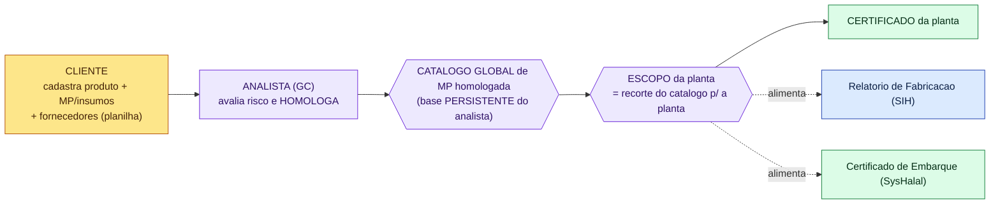
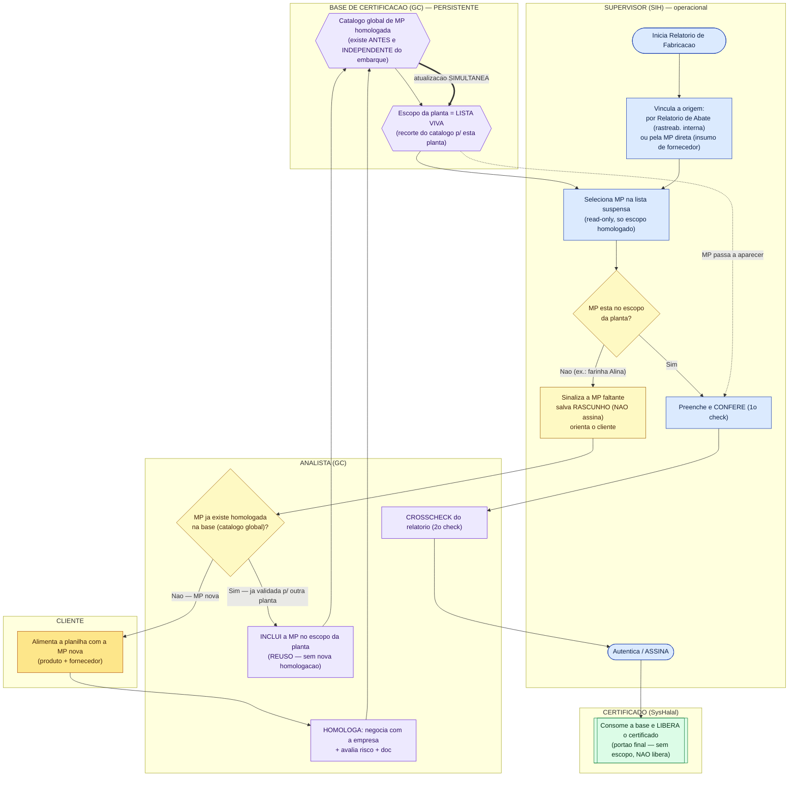
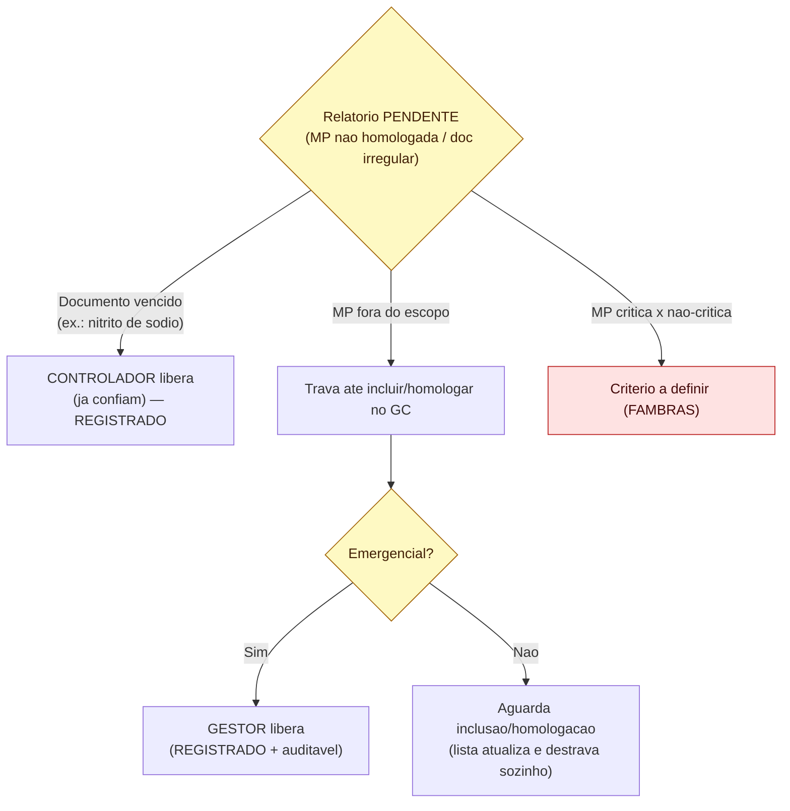

# Fluxograma — Relatório de Fabricação (MP fora de escopo + travas)

> Base: alinhamento FAMBRAS 30/jun/2026 (ver `ATA-ALINHAMENTO-FAMBRAS-2026-06-30.md`),
> **revisado a partir de 29:54 da transcrição** — descrição do fluxo IDEAL por **Elaine + Lina**
> (e a correção que o próprio Renato faz em 38:44, "dou um passo atrás").
>
> **Revisão 2 (feedback Lina 16:16):** a base de certificação **é PERSISTENTE** — o MP/escopo
> já existe na base do analista **antes e independentemente** do embarque. O certificado de
> embarque só **consome** essa base (portão final), não é onde os dados nascem.
>
> Pontos ❓ dependem de decisão interna FAMBRAS (matriz de criticidade de travas).

## ⚠️ O que mudou (correção conceitual)
| Antes (errado) | Agora (transcrição 29:54+ e feedback Lina) |
|---|---|
| Supervisor "registra a MP / sugestão de cadastro" | **O CLIENTE alimenta a planilha de MP.** O supervisor só **sinaliza/orienta**; o **analista homologa**. |
| Fluxo em 1 raia só | **Cadeia de atores** (Lina): Cliente → Analista → Controlador + Supervisor → autentica → Certificado. |
| Dados "checados no momento do embarque" | **Base de certificação PERSISTENTE** (Lina 16:16): MP/escopo já existem na base do analista; o embarque só **consome** (portão final). |
| Falta de MP = sempre homologação nova | **3 casos:** (1) já no escopo; (2) **já na base GC → analista só inclui no escopo** (reuso); (3) MP nova → homologação completa. |
| Lista atualiza "em tempo quase real" | Elaine: a atualização da lista tem de ser **SIMULTÂNEA**, senão **trava o supervisor**. |
| Double check implícito | **Explícito:** supervisor confere ao preencher (1º) + analista faz **crosscheck** (2º). |

---

## 1. A base de certificação é PERSISTENTE (não nasce no embarque)

> **Ponto da Lina:** os dados (MP/escopo) **existem na base ANTES** — alimentam tanto o
> relatório de fabricação quanto o certificado de embarque. O embarque é **consumidor**, não criador.

---

## 2. Fluxo do Relatório de Fabricação (raias por ator)

> A "lista suspensa" do supervisor **É** o escopo já homologado na base (read-only, GC).
> Quando falta uma MP, o gatilho vai para **analista/cliente** — e a 1ª pergunta é:
> **"já existe na base?"** (reuso) antes de abrir homologação nova.

---

## 3. Trava e desbloqueio (quem destrava) — ❓ FAMBRAS define

> Elaine: *"teoricamente tem que travar porque ele não pode usar; na prática a gente libera depois."*
> Lina: precisa de **desbloqueio por alguém, registrado — "pelo menos a gente sabe de onde veio."**

---

## 4. Princípios que o fluxo materializa (transcrição 29:54+ e feedback Lina)
1. **Base de certificação PERSISTENTE** (Lina 16:16): MP/escopo já existem na base do analista
   **antes** do embarque; o relatório de fabricação e o certificado de embarque **consomem** essa base.
2. **Cadeia de atores** (Lina): **Cliente** alimenta → **Analista** avalia/homologa → libera p/
   **Controlador + Supervisor** → supervisor **autentica** → **Certificado**.
3. **A planilha de MP é do CLIENTE.** O supervisor não cadastra MP — só **sinaliza** a falta e
   **orienta** o cliente; o analista resolve no GC.
4. **3 casos quando falta MP no escopo:** (1) já está no escopo → segue; (2) **já existe na base
   GC** → analista só **inclui no escopo** (reuso, rápido — Soha); (3) **MP nova** → homologação completa.
5. **Lista VIVA + atualização SIMULTÂNEA** (Elaine): assim que o analista inclui/homologa, a lista
   suspensa atualiza na hora; senão o supervisor fica travado.
6. **Double check**: supervisor confere ao preencher (1º) + analista faz **crosscheck** (2º).
7. **Trava na assinatura, não no registro**: o supervisor salva rascunho com o que tem; o que ele
   **não consegue** é **assinar/finalizar** com pendência.
8. **Desbloqueio sempre REGISTRADO** (quem autorizou) — auditável; "saber de onde veio".
9. **Embarque = portão final** (Lina): a validação acontece **a montante e continuamente** na base;
   o certificado de embarque apenas **lê** — sem produto no escopo, não libera.
10. **Origem da MP** (Renato 32:17): no relatório de fabricação a origem pode ser vinculada **por
    Relatório de Abate** (rastreabilidade interna) **ou pela MP direta** (insumo de fornecedor, sem abate).

## 5. Pontos abertos p/ a reunião de validação
- **Matriz de criticidade** (§3): o que trava direto vs. o que o controlador libera; **MP crítica × não-crítica** (Soha).
- **Quem é "gestor"** para liberação emergencial + forma do registro/escalonamento.
- **SLA da atualização "simultânea"** da lista após incluir/homologar (o que é aceitável p/ não travar o supervisor).
- **Caso "industrializado roteado como In Natura"** (Lina): um cert/relatório de **industrializado** foi
  classificado na divisão **In Natura** (roteamento errado entre as duas divisões do SIH) e "ninguém acha".
  Garantir **roteamento correto por categoria/divisão** + rastreabilidade (tela de status/pendências).
- **Reuso vs. inclusão no escopo** (decorrente do feedback Lina): confirmar que "incluir MP já
  homologada no escopo de outra planta" é ação do **analista** e **não** exige nova homologação completa.
