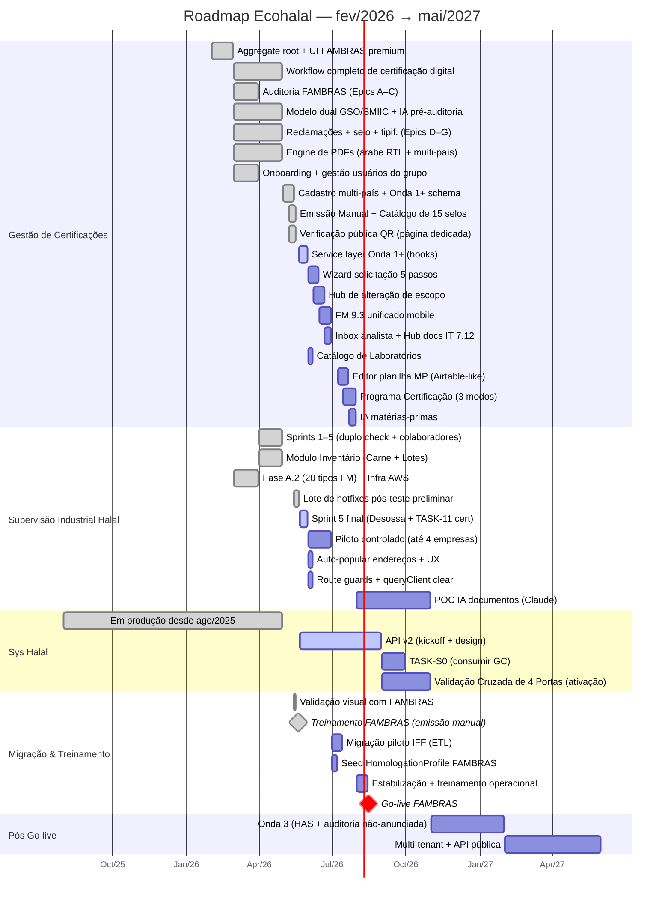
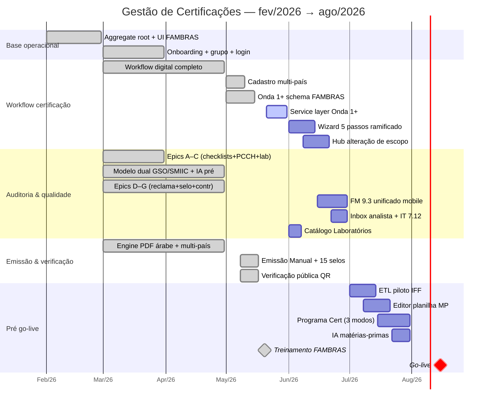
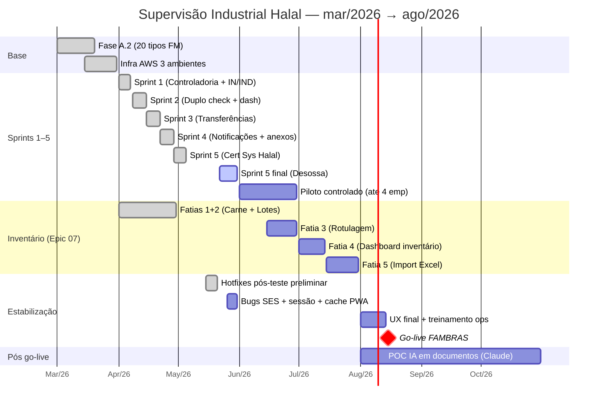

# Roadmap Ecohalal — Gantt 2026

**Última atualização:** 2026-05-21
**Horizonte:** fev/2026 → mai/2027
**Go-live FAMBRAS:** agosto/2026 (Gestão de Certificações + Supervisão Industrial Halal em operação plena)

Este documento espelha em formato de Gantt o conteúdo do roadmap público
servido por `GET /public/roadmap` (`halalsphere-backend/src/roadmap/roadmap-content.ts`).
Quando o roadmap público mudar, este Gantt deve ser atualizado no mesmo ciclo.

---

## Visão consolidada

---

## Recortes por sistema

### Apenas Gestão de Certificações (HalalSphere)

### Apenas Supervisão Industrial Halal

---

## Legenda

- `done` (preenchido): entregue em produção.
- `active` (em curso): trabalho ativo nesta semana.
- (sem marcação): próxima entrega, ainda não iniciada.
- `crit` + `milestone`: marco contratual.
- Datas usam **mês/ano** como granularidade primária; **N ª semana/mês** quando o intervalo é menor que 4 semanas.

## Como atualizar

1. Quando uma linha do roadmap público mudar de status, atualize aqui também.
2. Quando uma entrega de uma seção for concluída, mude `:` (vazio) → `:active` → `:done`.
3. Mantenha as cores das seções alinhadas com o roadmap público (Gestão de Certificações, Supervisão Industrial Halal, Sys Halal, Migração & Treinamento, Pós Go-live).
4. O Mermaid é renderizado nativamente pelo GitHub, GitLab e VS Code (extensão Mermaid).

## Fonte de verdade

- **Conteúdo textual:** `halalsphere-backend/src/roadmap/roadmap-content.ts` (servido em `/public/roadmap`).
- **Gantt visual:** este arquivo.

Para divergências entre os dois, o textual prevalece.
